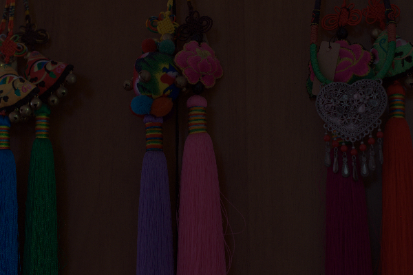
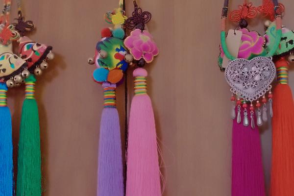

# Low-Light Image Enhancement with Zero-DiDCE and NLM Denoising and Laplacian Edge preservation

## Project Overview

This project presents a lightweight deep learning pipeline for enhancing low-light images and reducing noise artifacts introduced during enhancement. The system is built on a Zero-DiDCE inspired zero-reference low-light enhancement network, followed by an adaptive denoising module for perceptual quality improvement.

Low-light images typically suffer from:

* poor visibility
* low contrast
* color distortion
* amplified sensor noise

This project addresses these issues using a two-stage enhancement framework:

1. **Low-light enhancement using iterative curve estimation**
2. **Adaptive denoising with edge-preserving refinement**


## How to run Program

- Step 1 : Insert the test Image in  directory `data/test_data/lol-pre`.
- Step 2 : pip install -r requirements.txt
- step 3 : python lowlight_test.py
- step 4 : Output will be saved in the directory `data/result_ours/lol-pre`.


## Tech Stack

### Programming Language

* Python

### Deep Learning Framework

* PyTorch

### Image Processing

* OpenCV
* PIL (Python Imaging Library)
* NumPy

### Development Tools

* VS Code
* Jupyter / terminal

### Hardware Support

* CPU
* GPU (CUDA)
* Apple Silicon (MPS)

### Dataset : LOL Dataset (https://www.kaggle.com/datasets/soumikrakshit/lol-dataset)


## System Architecture

```text
Input Low-Light Image
        │
        ▼
Zero-DiDCE Enhancement Network
(learns enhancement curves)
        │
        ▼
Enhanced Image
        │
        ▼
Adaptive Denoising Module
(NLM + edge-preserving blending)
        │
        ▼
Final Enhanced Output
```


## Result 
- *Input Image*<br>
. 

- *Low Light Enhanced Image*<br>


- *Final Denoised and edge preserved Outut Image*<br>



