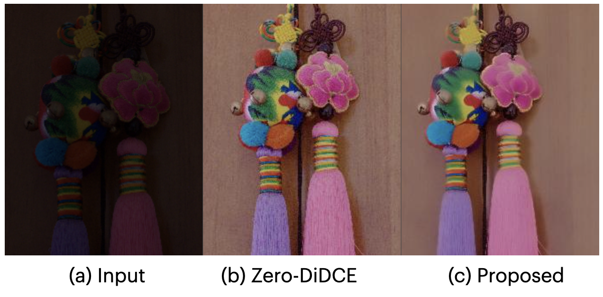
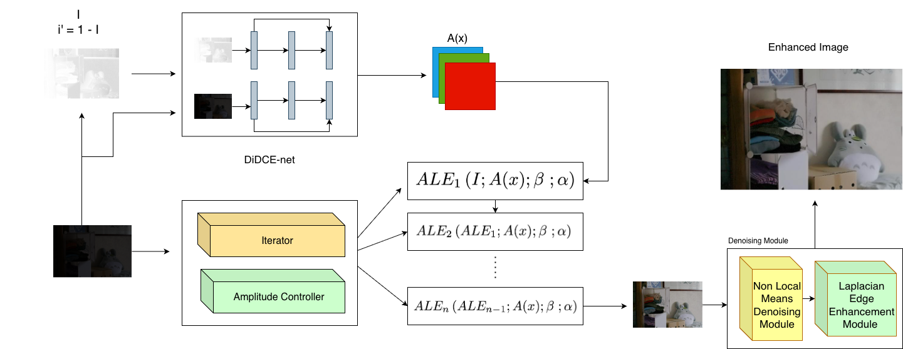

# 🧠 Zero DiDCE based Low Light Enhancement with edge Preserving Noise Supression

An improved low-light enhancement framework which combines Zero-DiDCE based illumination enhancement with a post-processing denoising and edge-preserving refinement module. The proposed refinement stage reduces enhancement generated noise while preserving structural details and image sharpness. Experiments performed on LOL dataset show that the proposed method achieves competitive performance with 18.36 PSNR, 0.743 SSIM and 4.41 NIMA. 

## Dataset Used : LOL dataset
The project uses LoL dataset for training and testing. 
Link : https://www.kaggle.com/datasets/soumikrakshit/lol-dataset

## Features
- Zero Reference Low Light Enhancement
- Adaptive Brightness Correction
- Dynamic Enhacement Strength
- Adaptive Iteration Control
- Noise Suppression Module
- Edge Preservation / Sharpness Recovery

## Tech Stack 

- Programming Language : Python
- Deep Learning framework : Pytorch
- Digital Image Processing : PIL , Numpy , OpenCV
- IDE : Visual Studio Code
- Hardware : Apple Silicon MPS (Mac air M4)

## Architecture
The proposed pipeline uses two stage enhancement framework : 
- Low Light Enhancement using iterative curve estimation
- Adaptive denoising with edge preserving refinement

## How to run Program
- Git clone https://github.com/vivek-patel-here/Low-Light-enhancement-with-ZeroDiDCE_NLM_denoiser_Laplacian_Edge_preservation.git
- RUN `cd Low-Light-enhancement-with-ZeroDiDCE_NLM_denoiser_Laplacian_Edge_preservation`
- RUN `pip install -r requirements.txt`
- Insert the test images in the dir `data/test_data/lol-pre`
- RUN `python lowlight_test.py`
- The output will be save in the dir `data/result_ours/lol-pre`

